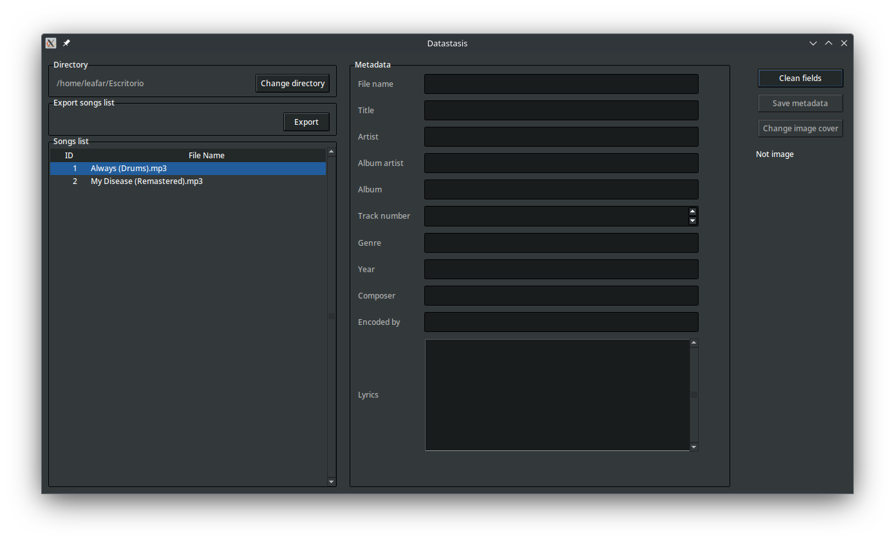
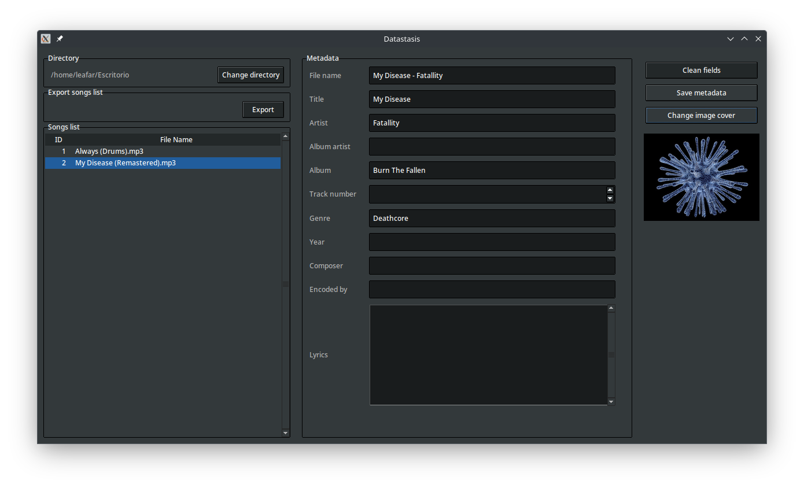
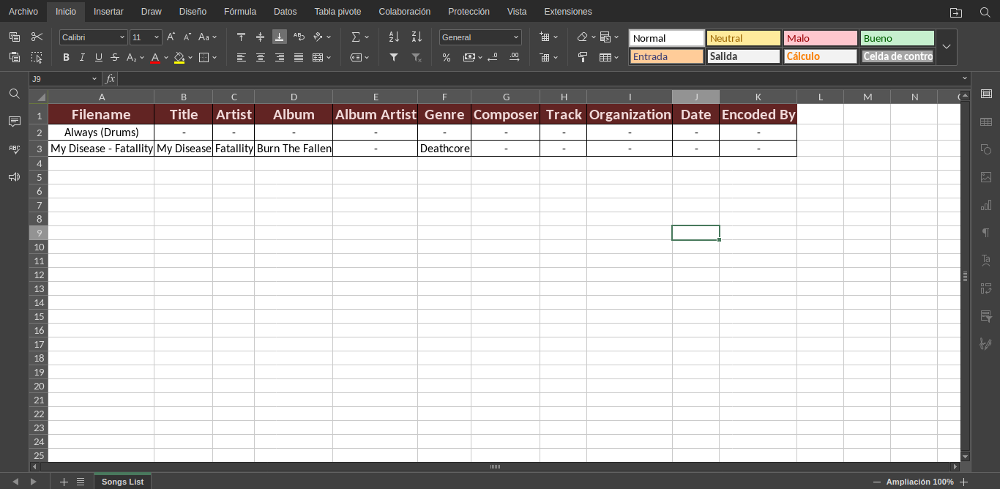

# Datastasis
**Datastasis** is a small application to modify song metadata and it also exports your songs in a list to an excel file

### Requeriments
```txt
# Requeriments.txt
mutagen
Pillow
XlsxWriter
```

### Theme
**awdark** from  [awthemes](https://sourceforge.net/projects/tcl-awthemes/)
Check the license [LICENSE](awthemes/LICENSE)

```python
# Line 27
self.tk.call('source', 'awthemes/awdark.tcl')
styles = ttk.Style()
styles.theme_use('awdark')
```

### Installation
```sh
# Clone the repo
$ git clone https://github.com/RafaelHorta/datastasis.git
# Change the working directory to datastasis
$ cd datastasis
# Install the requeriments
$ pip install -r requeriments.txt
```

### Screenshots
* Get songs list from your directory


* Fill out the form with the song metadata and even add a cover image


* Export your songs list to an Excel file


### License
License GPLv3. Please see [LICENSE](LICENSE)
